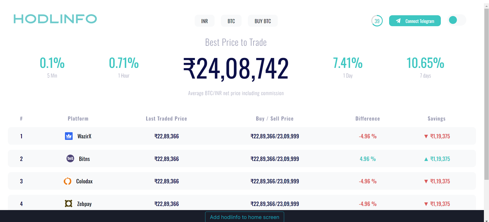
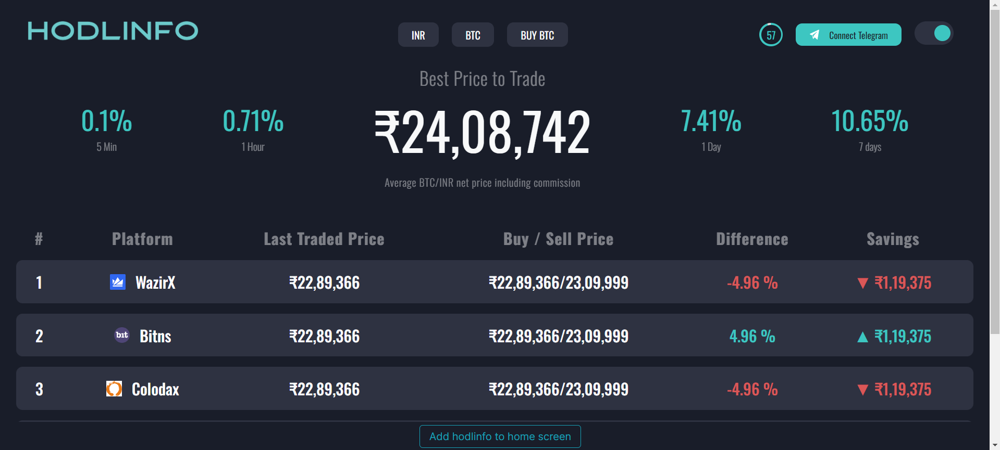

# Hodlinfo App (Internship Project)

This repository contains a copy project created for an internship, inspired by the Hodlinfo web application. The project aims to replicate the basic functionality and design of Hodlinfo, providing cryptocurrency ticker information from various platforms.

## Overview

The Hodlinfo app retrieves cryptocurrency ticker data from an external API, stores it in a MongoDB database, and displays it on a web interface. Users can view the latest cryptocurrency prices, buy/sell prices, and other relevant information.

## Features

- **Real-time Ticker Updates**: Retrieves cryptocurrency ticker data from an external API and updates the MongoDB database.
- **Display Ticker Information**: Renders the latest cryptocurrency ticker information on the web interface.
- **Responsive Design**: Provides a responsive web design for optimal viewing across different devices.

## Technologies Used

- **Node.js**: JavaScript runtime environment for server-side development.
- **Express.js**: Web application framework for Node.js.
- **MongoDB**: NoSQL database used for storing cryptocurrency ticker data.
- **Axios**: Promise-based HTTP client for making API requests.

## Screenshots

Include screenshots of the Hodlinfo app to provide a visual representation of its features and interface.

### light 



### Dark




## Installation

To run the Hodlinfo app locally, follow these steps:

1. Clone the repository:

```bash
git clone https://github.com/Praveenkumartiwari321/Hodlinfo-Quadb.git
```

2. Navigate to the project directory:

```bash
cd hodlinfo-app
```

3. Install dependencies:

```bash
npm install
```

4. Set up environment variables:

Create a `.env` file in the root directory and add the following variables:

```
PORT=4000
MONGO_URL=<your-mongodb-url>
SOURCE_URL=<external-api-source-url>
```

Replace `<your-mongodb-url>` with the URL of your MongoDB database and `<external-api-source-url>` with the URL of the external API source.

5. Run the application:

```bash
npm start
```

The application will start running on the specified port (default is 4000).

## Usage

Once the application is running, you can access it in your web browser by navigating to `http://localhost:4000`.

## Disclaimer

This project is created for educational purposes as part of an internship. It is not affiliated with or endorsed by Hodlinfo or any other existing cryptocurrency platform.

## Credits

This project is developed as part of an internship by Praveen Kumar Tiwari.

---

This README provides an overview of the Hodlinfo internship project, its features, installation instructions, and usage guidelines. For more detailed information, refer to the source code and documentation within the repository.
